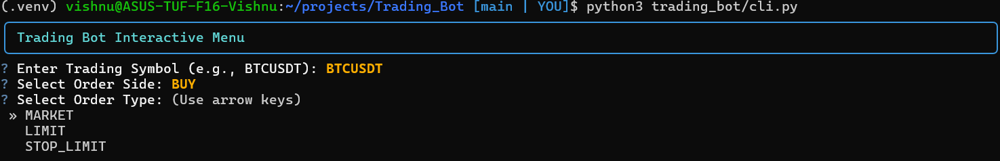
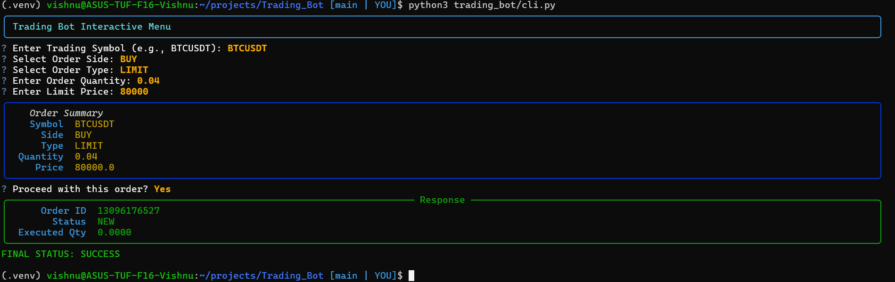
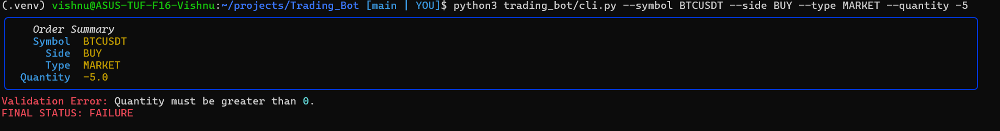
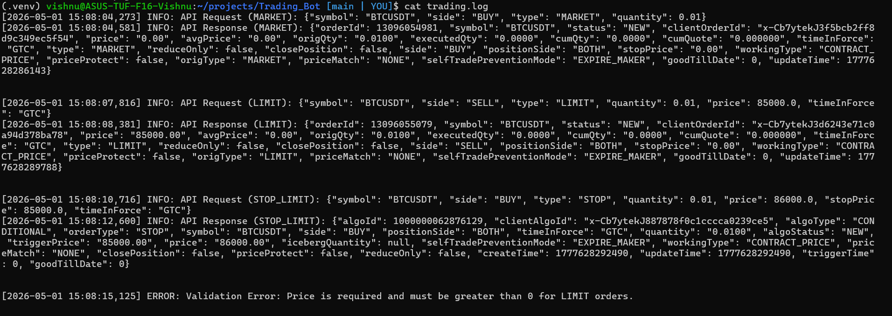

# Binance Futures Testnet Trading Bot

A production-quality Python trading bot for the Binance Futures Testnet (USDT-M), featuring a robust architecture, beautiful interactive CLI, and comprehensive validation. 

## Features
- **Supported Orders**: `MARKET`, `LIMIT`, and `STOP_LIMIT`.
- **Interactive UI**: A rich, prompt-based interactive menu with arrow-key navigation.
- **Headless Mode**: Full `argparse` support for standard CLI automation.
- **Strict Validation**: Pre-API payload validation to prevent malformed requests.
- **Clean Logging**: JSON-structured transaction logging with cleanly formatted errors.

## Project Structure
```text
Trading_Bot/
├── screenshots/              # Application screenshots
├── trading_bot/
│   ├── bot/
│   │   ├── __init__.py
│   │   ├── client.py         # Binance client wrapper
│   │   ├── orders.py         # Order placement & response parsing
│   │   ├── validators.py     # Centralized input validation
│   │   └── logging_config.py # Structured JSON logger
│   └── cli.py                # Main CLI entry point
├── requirements.txt          # Project dependencies
├── README.md                 # Usage instructions
└── sample_trading.log        # Sample output log
```

## Setup Instructions

1. **Clone the repository and navigate to the project root.**
2. **Create a virtual environment and install dependencies:**
   ```bash
   python3 -m venv .venv
   source .venv/bin/activate
   pip install -r requirements.txt
   ```
3. **Configure Environment Variables (Two Options):**
   - **Option A (Bypass File):** Simply run the script! If no `.env` file is found, the interactive CLI will securely prompt you to paste your Binance Futures Testnet API Key and Secret directly into the terminal.
   - **Option B (Create `.env`):** To avoid typing it every time, create a `.env` file in the root directory (next to this README) and add your credentials:
     ```env
     BINANCE_API_KEY=your_testnet_api_key_here
     BINANCE_API_SECRET=your_testnet_api_secret_here
     ```

## Usage

### 1. Interactive Mode (Recommended)
Launch the beautiful, prompt-based interactive menu by running the script without any arguments. It includes input validation and styled summary tables:
```bash
python3 trading_bot/cli.py
```

### Interactive CLI Menu


### Completed Order Response


### Failed Order Validation


### 2. Headless Mode (Command Line Arguments)
You can bypass the interactive menu by providing the required arguments directly. This is ideal for scripts or automation.

**Market Order:**
```bash
python3 trading_bot/cli.py --symbol BTCUSDT --side BUY --type MARKET --quantity 0.01
```

**Limit Order:**
```bash
python3 trading_bot/cli.py --symbol BTCUSDT --side SELL --type LIMIT --quantity 0.01 --price 85000
```

**Stop-Limit Order:**
```bash
python3 trading_bot/cli.py --symbol BTCUSDT --side BUY --type STOP_LIMIT --quantity 0.01 --price 86000 --stop_price 85000
```

## Logs
All API requests, successful responses, and errors are cleanly logged into `trading.log` (generated automatically upon first run) in structured JSON format.

### JSON Structured Logging
