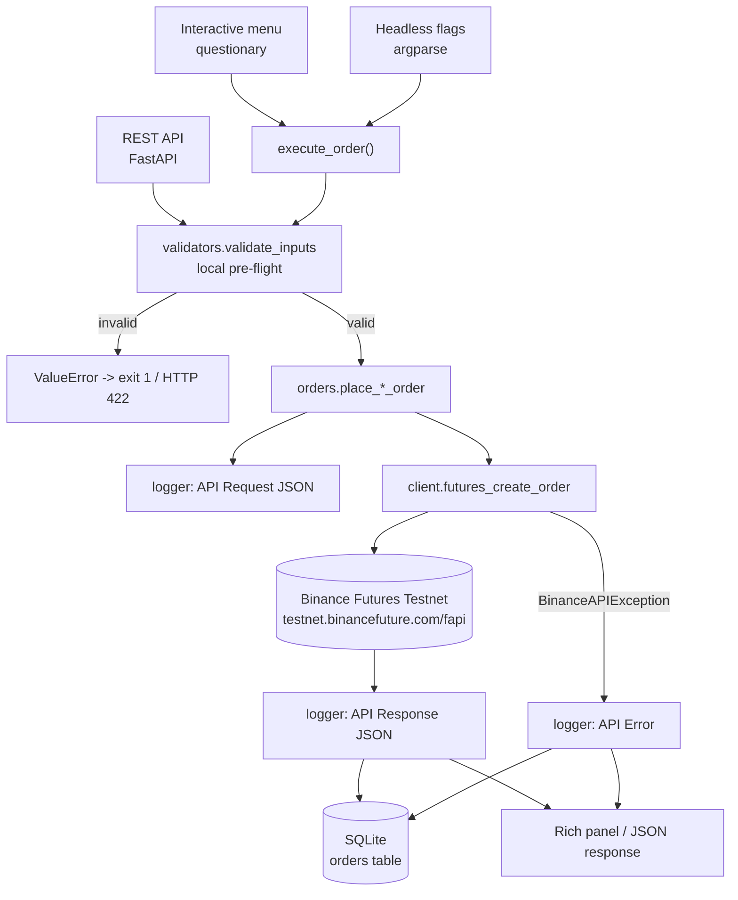
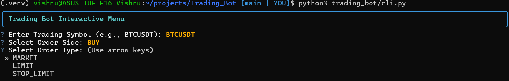
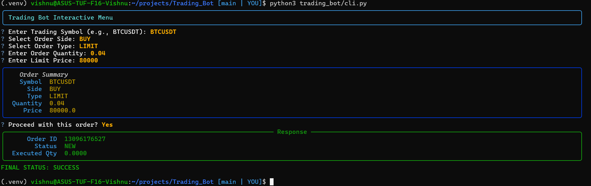
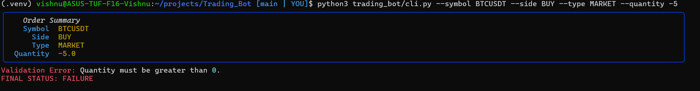
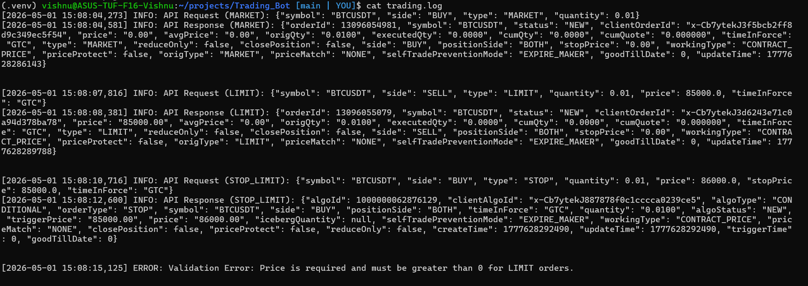

<h1 align="center">Binance Futures Testnet Trading Bot</h1>

<p align="center">
  A USDT-M futures order client with three interfaces over one execution core —<br>
  an arrow-key interactive menu for humans, argparse flags for scripts, and a REST API.
</p>

<p align="center">
  
  
  
  
  
  
  
  
  
  
  <br>
  <a href="https://github.com/VishnujanNarayanan/binance-futures-trading-bot/actions/workflows/ci.yml"></a>
  <br>
  <a href="https://vishnujan-narayanan.vercel.app/"></a>
  <a href="https://github.com/VishnujanNarayanan"></a>
  <a href="https://www.linkedin.com/in/vishnujan-narayanan"></a>
  <a href="https://substack.com/@vishnujannarayanan"></a>
</p>

<p align="center">
  🎯 <a href="#why-this-project-exists">Why</a> ·
  🧩 <a href="#architecture">Architecture</a> ·
  🧠 <a href="#design-decisions">Design Decisions</a> ·
  ⚡ <a href="#installation">Installation</a> ·
  🧑‍💻 <a href="#usage">Usage</a> ·
  🌐 <a href="#rest-api">REST API</a> ·
  📖 <a href="#published-api-docs">API Docs</a> ·
  🐳 <a href="#docker">Docker</a> ·
  🧪 <a href="#testing">Testing</a> ·
  🖼️ <a href="#screenshots">Screenshots</a> ·
  ⚠️ <a href="#limitations">Limitations</a>
</p>

---

## Why this project exists

Placing a futures order through a raw API client means hand-assembling a parameter dictionary
where a missing `timeInForce`, a lowercase symbol, or a `price` on a market order is rejected
only after the request leaves the machine. Debugging that from an exchange error code is slow.

This bot puts a validation layer in front of the API, so malformed orders fail locally with a
message that names the actual problem, and wraps the whole thing in three interfaces that share
one execution path: a guided interactive menu, flag-driven invocation for automation, and an
HTTP API.

Every request and every response is written to a structured log **and** recorded in a local
SQLite database — including rejected orders — so what was sent and what happened to it is
always recoverable after the fact.

## Features

- **Order types** — `MARKET`, `LIMIT` (GTC), and `STOP_LIMIT`.
- **Position management** — list open positions with entry price, mark price and unrealised
  PnL; close any position with a `reduceOnly` market order in the opposite direction.
- **Interactive mode** — arrow-key menu, masked credential prompts, a summary table, and an
  explicit confirmation step before anything is sent.
- **Headless mode** — full `argparse` interface with non-zero exit codes on failure.
- **Pre-flight validation** — symbol casing, side, order type, positive quantity, and
  conditional price/stop-price requirements checked before the API call.
- **Order history** — every attempt, filled or rejected, persisted to SQLite with a
  `--action history` view and a per-symbol `--action summary` built on a SQL view.
- **REST API** — the same execution core exposed over HTTP via FastAPI, with OpenAPI docs.
- **Structured logging** — every request and response serialised as JSON to `trading.log`.
- **Credential fallback** — reads `.env`, and if absent prompts interactively rather than
  crashing.
- **Containerised** — a Dockerfile that runs as a non-root user, with logs on a volume.
- **Tested and gated** — 63 tests, plus CI running lint, the suite on Python 3.9 and 3.12,
  and a Docker image build on every pull request.

## Architecture

All three entry paths converge on the same validated core, so validation, logging, history
recording and error handling behave identically whether a human, a script or an HTTP client
drove it.


```mermaid
flowchart TB
    A["Interactive menu<br/>questionary"] --> E
    B["Headless flags<br/>argparse"] --> E
    H["REST API<br/>FastAPI"] --> V
    E["execute_order()"] --> V["validators.validate_inputs<br/>local pre-flight"]
    V -->|invalid| X["ValueError -> exit 1 / HTTP 422"]
    V -->|valid| O["orders.place_*_order"]
    O --> L1["logger: API Request JSON"]
    O --> C["client.futures_create_order"]
    C --> API[("Binance Futures Testnet<br/>testnet.binancefuture.com/fapi")]
    API --> L2["logger: API Response JSON"]
    L2 --> D[("SQLite<br/>orders table")]
    L2 --> R["Rich panel / JSON response"]
    C -->|BinanceAPIException| L3["logger: API Error"] --> D
    L3 --> R
```

### Module responsibilities

| Module | Responsibility |
|---|---|
| `trading_bot/cli.py` | Both interfaces, Rich rendering, `execute_order` / `execute_close` |
| `trading_bot/bot/client.py` | Credential resolution, testnet client construction |
| `trading_bot/bot/orders.py` | Order payload assembly, position listing, position closing |
| `trading_bot/bot/validators.py` | Pure input validation, no I/O |
| `trading_bot/bot/logging_config.py` | Single named logger writing `trading.log` |
| `trading_bot/bot/storage.py` | SQLite order history: record, query, aggregate |
| `trading_bot/bot/schema.sql` | Table, CHECK constraints, indexes, `symbol_activity` view |
| `trading_bot/api.py` | FastAPI app exposing the same core over HTTP |

## Design Decisions

**Validation is a pure function with no I/O.** `validate_inputs` returns a normalised tuple
`(symbol, side, order_type, quantity, price, stop_price)` and raises `ValueError` otherwise.
Because it touches nothing external, the conditional rules — price required for `LIMIT` and
`STOP_LIMIT`, stop price required for `STOP_LIMIT` — are trivially checkable.

**Interactive mode is chosen by `len(sys.argv) == 1`**, not a flag. Running the script bare is
the discoverable path; passing any argument means the caller is scripting and expects headless
behaviour, including exit codes.

**Exit codes are conditional on mode.** Failures call `sys.exit(1)` only when
`len(sys.argv) > 1`. In interactive mode an error prints and returns to the menu rather than
killing the session.

**Closing is derived, never specified.** `close_position` reads the live position, infers the
side from the sign of `positionAmt`, uses `abs(amt)` as quantity, and sets `reduceOnly: true` —
so a close can never accidentally open an opposing position.

**The futures URL is pinned explicitly.** `client.FUTURES_URL` is overridden to
`https://testnet.binancefuture.com/fapi` after construction, rather than relying on the
library's testnet handling alone.

**Requests are logged before responses.** The request JSON is written before the call is made,
so an order that times out still leaves a record of what was attempted.

**The client is built lazily.** `get_client()` constructs on first use and caches, rather than
running at import time. Importing the package therefore resolves no credentials and touches no
network, which is what makes the test suite, the container smoke test and `GET /health` all
work without an API key.

**Bookkeeping is best-effort and can never break an order.** `record_order` swallows and logs
its own failures. A successfully placed order must not turn into a SQLite exception on the
caller's side — there is a test that an unwritable database still returns the order result.

**Rejected orders get a history row too.** They are stored with the exchange error and a null
order id. A failed attempt being simply absent from the record was the main thing worth fixing.

**Constraints live in the schema, not only in Python.** `side`, `order_type` and
`quantity > 0` are `CHECK` constraints, so a nonsense row cannot be written even by hand.
Note that `STOP_LIMIT` is submitted to Binance as type `STOP`, so the wire value is mapped back
to the bot's own vocabulary before it is stored.

## Project Structure

```
Trading_Bot/
├── trading_bot/
│   ├── cli.py                 # Entry point: interactive menu + argparse
│   ├── api.py                 # Entry point: FastAPI REST interface
│   └── bot/
│       ├── client.py          # Testnet client, lazy credential resolution
│       ├── orders.py          # MARKET / LIMIT / STOP_LIMIT, positions, close
│       ├── validators.py      # Pure pre-flight validation
│       ├── storage.py         # SQLite order history
│       ├── schema.sql         # Table, constraints, indexes, activity view
│       └── logging_config.py  # Named logger -> trading.log
├── tests/                     # 63 pytest tests, no network or API key needed
├── .github/workflows/ci.yml   # Lint, tests on 3.9 + 3.12, Docker build
├── Dockerfile
├── render.yaml                # Render Blueprint for the REST API
├── screenshots/               # CLI captures used below
├── sample_trading.log         # Recorded request/response/error log
├── requirements.txt           # CLI runtime
├── requirements-api.txt       # REST interface
├── requirements-dev.txt       # pytest + ruff
└── README.md
```

## Installation

Clone and enter the project:

```bash
git clone https://github.com/VishnujanNarayanan/binance-futures-trading-bot.git
cd binance-futures-trading-bot
```

Create a virtual environment and install dependencies:

```bash
python3 -m venv .venv
source .venv/bin/activate      # Linux / macOS
.venv\Scripts\activate         # Windows
pip install -r requirements.txt
```

Optional extras:

```bash
pip install -r requirements-api.txt      # REST interface
pip install -r requirements-dev.txt      # pytest + ruff
```

## Configuration

Credentials are resolved in this order:

1. A `.env` file in the directory the bot is run from.
2. Interactive masked prompts, if no `.env` is found and stdin is a TTY.
3. Otherwise a `ValueError` is raised.

| Variable | Required | Description |
|---|---|---|
| `BINANCE_API_KEY` | Yes | Binance **Futures Testnet** API key |
| `BINANCE_API_SECRET` | Yes | Binance **Futures Testnet** API secret |
| `TRADING_BOT_API_KEY` | For the REST API | Gates the endpoints that can place or close orders |
| `TRADING_BOT_CORS_ORIGINS` | No | Comma-separated browser origins allowed to call the API |
| `TRADING_BOT_DB` | No | Order history database path (default `trading_bot.db`) |
| `TRADING_BOT_LOG` | No | Log file path (default `trading.log`) |

```env
BINANCE_API_KEY=your_testnet_api_key_here
BINANCE_API_SECRET=your_testnet_api_secret_here
```

Testnet keys are issued at [testnet.binancefuture.com](https://testnet.binancefuture.com) and
are separate from live Binance keys.

## Usage

### Interactive mode

```bash
python3 trading_bot/cli.py
```

Presents a menu with six options: place a new order, view open positions, close a position,
view order history, view an activity summary, and exit. Order entry collects each parameter in turn, prints a summary table, and requires
confirmation before sending.

### Headless mode

```bash
# Market order
python3 trading_bot/cli.py --symbol BTCUSDT --side BUY --type MARKET --quantity 0.01

# Limit order
python3 trading_bot/cli.py --symbol BTCUSDT --side SELL --type LIMIT \
    --quantity 0.01 --price 85000

# Stop-limit order
python3 trading_bot/cli.py --symbol BTCUSDT --side BUY --type STOP_LIMIT \
    --quantity 0.01 --price 86000 --stop_price 85000

# List open positions
python3 trading_bot/cli.py --action positions

# Close a position
python3 trading_bot/cli.py --action close --symbol BTCUSDT

# Order history (newest first), optionally filtered
python3 trading_bot/cli.py --action history
python3 trading_bot/cli.py --action history --symbol BTCUSDT --limit 50

# Per-symbol activity totals
python3 trading_bot/cli.py --action summary
```

| Flag | Type | Required for |
|---|---|---|
| `--action` | `order` \| `positions` \| `close` \| `history` \| `summary` | defaults to `order` |
| `--symbol` | string | all order actions and `close` |
| `--side` | `BUY` \| `SELL` (case-insensitive) | orders |
| `--type` | `MARKET` \| `LIMIT` \| `STOP_LIMIT` | orders |
| `--quantity` | float > 0 | orders |
| `--price` | float > 0 | `LIMIT`, `STOP_LIMIT` |
| `--stop_price` | float > 0 | `STOP_LIMIT` |
| `--limit` | int | `history` (default 20) |

The bot must be run from the project root — `cli.py` imports `bot.*` as a top-level package.

## REST API

The same execution core over HTTP. An order placed here is validated, logged and recorded
exactly as one placed from the terminal — `api.py` calls into `bot.validators` and `bot.orders`
rather than reimplementing anything.

```bash
pip install -r requirements.txt -r requirements-api.txt
cd trading_bot && uvicorn api:app --reload
```

Interactive OpenAPI docs are then at `http://127.0.0.1:8000/docs`.

| Method | Path | Description |
|---|---|---|
| `GET` | `/health` | Liveness. Touches nothing and needs no credentials |
| `POST` | `/orders` | Validate and place an order |
| `GET` | `/positions` | Open positions, from the exchange |
| `POST` | `/positions/{symbol}/close` | Close one position, reduce-only |
| `GET` | `/orders/history` | Local history; `?symbol=` and `?limit=` |
| `GET` | `/orders/summary` | Per-symbol totals from the SQL view |

### Authentication

Reads are open, so the docs stay useful to anyone who opens them. **Anything that can move
money — placing an order, closing a position — requires an `X-API-Key` header.**

Generate a key and set it on the service:

```bash
python -c "import secrets; print(secrets.token_urlsafe(32))"
export TRADING_BOT_API_KEY=<the generated value>
```

```bash
curl -X POST http://127.0.0.1:8000/orders \
  -H "X-API-Key: $TRADING_BOT_API_KEY" \
  -H 'Content-Type: application/json' \
  -d '{"symbol":"BTCUSDT","side":"BUY","type":"MARKET","quantity":0.01}'
```

In `/docs`, the **Authorize** button sets the header for you.

Three deliberate choices:

- **It fails closed.** If `TRADING_BOT_API_KEY` is unset the service still starts and still
  serves reads, but every trading request returns `503`. An unconfigured deployment refuses to
  trade rather than quietly accepting anonymous orders.
- **Auth is checked before the request body.** An unauthenticated caller gets `401` even for a
  malformed body, so the schema cannot be probed by watching which payloads return `422`.
- **Keys are compared with `secrets.compare_digest`**, so response timing cannot be used to
  guess a key character by character.

Still open by design: `/positions`, `/orders/history` and `/orders/summary` return account
data without a key. On a testnet account that is a reasonable trade for a browsable demo — but
it is a choice, not an oversight, and the same dependency would lock them down.

Status codes are meaningful rather than uniform:

- **422** — local validation failed, so nothing was sent to the exchange
- **404** — closing a symbol with no open position
- **502** — the exchange rejected the request

```bash
curl -X POST http://127.0.0.1:8000/orders \
  -H 'Content-Type: application/json' \
  -d '{"symbol":"BTCUSDT","side":"BUY","type":"MARKET","quantity":0.01}'
```

### Published API docs

**<https://vishnujannarayanan.github.io/binance-futures-trading-bot/>**

GitHub Pages serves static files and cannot run FastAPI, so `scripts/build_docs.py` dumps the
OpenAPI schema at build time and renders it with a standalone Swagger UI. The result loads
instantly and never sleeps, which the live service cannot promise on a free instance.

The split is deliberate:

| | Hosted on | Cold start | What it is for |
|---|---|---|---|
| Documentation | GitHub Pages | none | Seeing what the API does |
| Live API | Render | ~45s if idle | Actually calling it |

**Try it out** on that page issues real requests against the Render deployment, which is why
the API allows the `github.io` origin through CORS. Reads work for anyone; placing or closing
an order needs the `X-API-Key` header via **Authorize**.

Publishing is handled by `.github/workflows/pages.yml` on every push to `main`. It needs
**Settings → Pages → Source: GitHub Actions** set once on the repository.

Build it locally with:

```bash
python scripts/build_docs.py site && python -m http.server -d site
```

### Deploying it

`render.yaml` is a Render Blueprint: **New → Blueprint → pick this repo**, then set
`BINANCE_API_KEY` and `BINANCE_API_SECRET` when prompted.

> **The region must not be a US one.** Binance geo-blocks US datacentres, so every endpoint
> that touches the exchange returns
> `APIError(code=0): Service unavailable from a restricted location`. Render defaults to
> Oregon, which fails exactly this way. `render.yaml` pins `region: singapore`.
> Render cannot change the region of an existing service — if one was already created in a US
> region, delete it and re-create it from the Blueprint.

Two more caveats on the free plan: instances sleep after about 15 minutes idle, and there is no
persistent disk — so `TRADING_BOT_DB` points at `/tmp` and history is lost on restart. Attach a
disk on a paid plan to keep it.

### Cold starts

A slept instance takes roughly a minute to answer its first request. Almost none of that is
this application — importing the whole app measures **0.55s**, of which `python-binance` is
0.35s. The rest is Render scheduling and starting the container, which nothing in this repo
can influence. Shaving imports would buy under a second of a sixty-second wait, so the code is
left readable instead.

What actually works, in order of effectiveness:

| Approach | Effect | Cost |
|---|---|---|
| Paid instance | No spin-down at all | ~$7/month |
| Scheduled ping (`.github/workflows/keep-warm.yml`) | No cold start during the pinged window | Free |
| Optimising app imports | ~0.35s of ~60s | Not worth it |

The keep-warm workflow pings `/health` every 10 minutes between 02:00 and 17:59 UTC
(07:30–23:29 IST), so the instance stays awake through the hours anyone is likely to open the
link and sleeps overnight. It runs on a window rather than around the clock because Render's
free tier bills instance-hours against a monthly allowance, and keeping one service awake 24/7
consumes essentially all of it. Widen the cron to `*/10 * * * *` to trade that allowance for
constant availability.

Two things to know about it: GitHub's scheduled workflows can run late under load, so an
occasional gap longer than Render's idle timeout will still produce a cold start; and GitHub
disables schedules on a repository with no activity for 60 days.

## Docker

```bash
docker build -t trading-bot .

docker run --rm -it --env-file .env trading-bot                     # interactive menu
docker run --rm --env-file .env trading-bot --action positions      # headless
docker run --rm --env-file .env -v "$PWD/logs:/app/logs" trading-bot --action history
```

Interactive mode needs a TTY, hence `-it`. The image runs as a non-root user, writes logs to
`/app/logs` (declared as a volume), and `.dockerignore` excludes `.env` so credentials cannot
be baked into a layer.

## Testing

```bash
pip install -r requirements.txt -r requirements-dev.txt -r requirements-api.txt
pytest          # 63 passed
ruff check trading_bot tests
```

The suite needs **no API key and no network**: a `FakeClient` fixture stands in for the Binance
client, records the payloads it was handed, and replays canned responses. Each test also gets
its own throwaway SQLite database.

| File | Covers |
|---|---|
| `tests/test_validators.py` | Normalisation and every rejection branch |
| `tests/test_orders.py` | Payload assembly, close derivation, response formatting, history wiring |
| `tests/test_storage.py` | Schema idempotency, CHECK constraints, view aggregation, resilience |
| `tests/test_client.py` | Lazy construction, caching, credential failure |
| `tests/test_api.py` | Every endpoint, and that the API shares the CLI's validator |

### Continuous integration

`.github/workflows/ci.yml` runs on every push and pull request:

| Job | What |
|---|---|
| Lint | `ruff check trading_bot tests` |
| Test | `pytest` on Python 3.9 and 3.12 |
| Docker build | Builds the image and runs it with `--help` |

The ruff rule set is pinned in `pyproject.toml` on purpose — ruff changes its defaults between
releases, so without pinning a local run and a CI run would enforce different things.

## Screenshots

<p align="center">
  
</p>

Order creation via arrow keys and validated text input. Positions can be viewed and selectively
closed from the same menu.

<p align="center">
  
</p>

On success the response panel reports order ID, status, executed quantity, and average price
when the order filled.

<p align="center">
  
</p>

Failures are categorised: local `ValueError` for validation, `BinanceAPIException` with the
exchange's code and message for rejected requests, and a generic branch for anything else. Each
path ends in an explicit `FINAL STATUS` line.

<p align="center">
  
</p>

## Example Workflow

A full session, as recorded in [`sample_trading.log`](sample_trading.log):

```
[15:08:04] INFO: API Request (MARKET): {"symbol": "BTCUSDT", "side": "BUY", "type": "MARKET", "quantity": 0.01}
[15:08:04] INFO: API Response (MARKET): {"orderId": 13096054981, "status": "NEW", ...}

[15:08:07] INFO: API Request (LIMIT): {"symbol": "BTCUSDT", "side": "SELL", "type": "LIMIT", "quantity": 0.01, "price": 85000.0, "timeInForce": "GTC"}
[15:08:08] INFO: API Response (LIMIT): {"orderId": 13096055079, "status": "NEW", ...}

[15:08:10] INFO: API Request (STOP_LIMIT): {"symbol": "BTCUSDT", "side": "BUY", "type": "STOP", "quantity": 0.01, "price": 86000.0, "stopPrice": 85000.0, "timeInForce": "GTC"}
[15:08:12] INFO: API Response (STOP_LIMIT): {"algoId": 1000000062876129, "algoType": "CONDITIONAL", "algoStatus": "NEW", ...}

[15:08:15] ERROR: Validation Error: Price is required and must be greater than 0 for LIMIT orders.
[15:08:17] ERROR: Validation Error: Quantity must be greater than 0.
[15:08:20] ERROR: API Error (LIMIT): APIError(code=-4002): Price greater than max price.
```

This shows both failure classes side by side: the first two errors never reached the network,
while the third was rejected by the exchange.

Note that `STOP_LIMIT` is submitted as Binance's `STOP` type and comes back as a conditional
algo order with an `algoId` rather than an `orderId`.

## Dependencies

| Package | Why |
|---|---|
| `python-binance` | Futures REST client and typed `BinanceAPIException` |
| `python-dotenv` | Loads credentials from `.env` |
| `questionary` | Arrow-key selection, confirmations, masked credential input |
| `rich` | Tables, panels, and status spinners in the terminal |
| `fastapi` + `uvicorn` | REST interface (optional, `requirements-api.txt`) |
| `pytest` + `ruff` | Tests and linting (optional, `requirements-dev.txt`) |

SQLite needs no dependency — it is in the Python standard library.

## Limitations

- **Testnet only.** The endpoint is hardcoded to `testnet.binancefuture.com`; there is no
  live-trading path, by design.
- **Working directory matters.** `cli.py` and `api.py` import their package as top-level
  `bot.*`, so the process must start inside `trading_bot/`. The Dockerfile and `render.yaml`
  both handle this; a manual run has to.
- **No quantity or price precision handling.** Binance's per-symbol tick and lot sizes are not
  consulted, so precision errors surface as exchange rejections rather than local ones.
- **Validation rejects lowercase symbols** rather than normalising them, unlike `side` and
  `type`, which are upper-cased for the caller.
- **Order history is local, not reconciled.** It records what this bot sent and what came back.
  It is not refreshed afterwards, so an order that later fills or is cancelled elsewhere still
  shows its status at submission time.
- **No rate limiting or retry logic.**
- **Read endpoints expose account data.** `/positions`, `/orders/history` and
  `/orders/summary` need no key, so anyone with the URL can see positions and order history.
  Writes are gated; reads are open on purpose so the demo is browsable.
- **One shared key, no rotation.** A single `TRADING_BOT_API_KEY` gates every write. There is
  no per-client key, no expiry and no revocation short of changing the value and restarting.

## Roadmap

- Fetch symbol filters from `futures_exchange_info` and round quantity/price locally.
- Normalise symbol casing instead of rejecting it.
- Reconcile stored order status against the exchange, so history reflects fills after the fact.
- Add `OCO` and trailing-stop order types.

Done since the first release: lazy client construction, a configurable log path, explicit
handling of the conditional-order response shape, SQLite order history, a REST interface,
a container image, CI, and API-key authentication on the trading endpoints.

## License

Released under the MIT License — free to use, modify and distribute, with attribution and
without warranty.

> **Disclaimer:** This bot targets the Binance Futures **testnet** only. Nothing here is
> financial advice, and it is not built for live capital.

## Author

<p align="center">
  <strong>Vishnujan Narayanan</strong>
</p>

<p align="center">
  <a href="https://vishnujan-narayanan.vercel.app/"></a>
  <a href="https://github.com/VishnujanNarayanan"></a>
  <a href="https://www.linkedin.com/in/vishnujan-narayanan"></a>
  <a href="https://substack.com/@vishnujannarayanan"></a>
</p>
