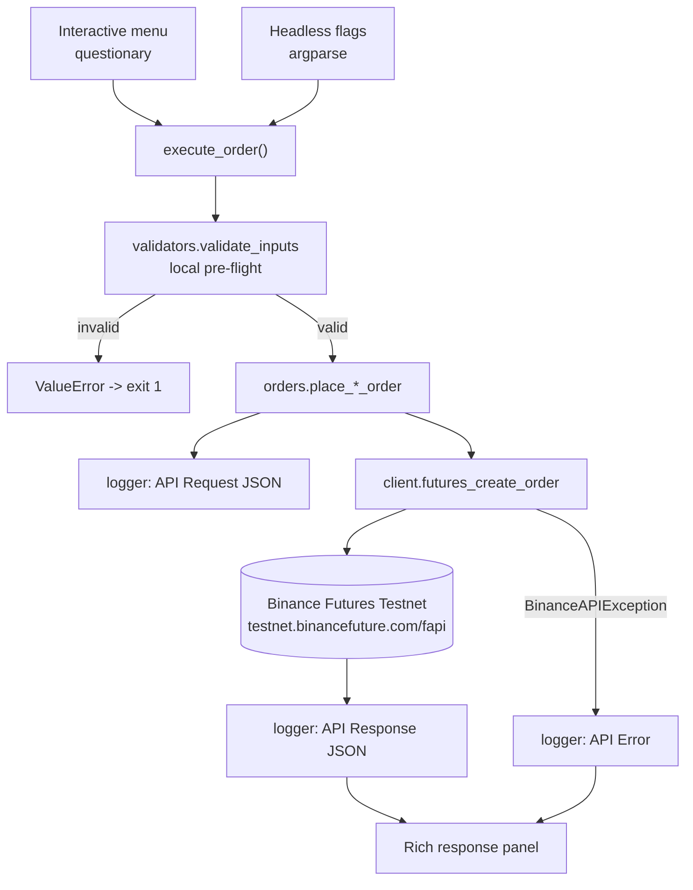

<h1 align="center">Binance Futures Testnet Trading Bot</h1>

<p align="center">
  A USDT-M futures order client with two interfaces over one execution core —<br>
  an arrow-key interactive menu for humans, and argparse flags for scripts.
</p>

<p align="center">
  
  
  
  
  
  
  <br>
  <a href="https://github.com/VishnujanNarayanan"></a>
  <a href="https://www.linkedin.com/in/vishnujan-narayanan"></a>
  <a href="https://substack.com/@vishnujannarayanan"></a>
</p>

<p align="center">
  🎯 <a href="#why-this-project-exists">Why</a> ·
  🧩 <a href="#architecture">Architecture</a> ·
  🧠 <a href="#design-decisions">Design Decisions</a> ·
  ⚡ <a href="#installation">Installation</a> ·
  🧑‍💻 <a href="#usage">Usage</a> ·
  🖼️ <a href="#screenshots">Screenshots</a> ·
  ⚠️ <a href="#limitations">Limitations</a>
</p>

---

## Why this project exists

Placing a futures order through a raw API client means hand-assembling a parameter dictionary
where a missing `timeInForce`, a lowercase symbol, or a `price` on a market order is rejected
only after the request leaves the machine. Debugging that from an exchange error code is slow.

This bot puts a validation layer in front of the API, so malformed orders fail locally with a
message that names the actual problem, and wraps the whole thing in two interfaces that share
one execution path: a guided interactive menu, and flag-driven invocation for automation.

Every request and every response is written to a structured log, so what was sent and what came
back is always recoverable after the fact.

## Features

- **Order types** — `MARKET`, `LIMIT` (GTC), and `STOP_LIMIT`.
- **Position management** — list open positions with entry price, mark price and unrealised
  PnL; close any position with a `reduceOnly` market order in the opposite direction.
- **Interactive mode** — arrow-key menu, masked credential prompts, a summary table, and an
  explicit confirmation step before anything is sent.
- **Headless mode** — full `argparse` interface with non-zero exit codes on failure.
- **Pre-flight validation** — symbol casing, side, order type, positive quantity, and
  conditional price/stop-price requirements checked before the API call.
- **Structured logging** — every request and response serialised as JSON to `trading.log`.
- **Credential fallback** — reads `.env`, and if absent prompts interactively rather than
  crashing.

## Architecture

Both entry paths converge on `execute_order`, so validation, logging, and error handling behave
identically whether a human or a script drove it.


```mermaid
flowchart TB
    A["Interactive menu<br/>questionary"] --> E
    B["Headless flags<br/>argparse"] --> E
    E["execute_order()"] --> V["validators.validate_inputs<br/>local pre-flight"]
    V -->|invalid| X["ValueError -> exit 1"]
    V -->|valid| O["orders.place_*_order"]
    O --> L1["logger: API Request JSON"]
    O --> C["client.futures_create_order"]
    C --> API[("Binance Futures Testnet<br/>testnet.binancefuture.com/fapi")]
    API --> L2["logger: API Response JSON"]
    L2 --> R["Rich response panel"]
    C -->|BinanceAPIException| L3["logger: API Error"] --> R
```

### Module responsibilities

| Module | Responsibility |
|---|---|
| `trading_bot/cli.py` | Both interfaces, Rich rendering, `execute_order` / `execute_close` |
| `trading_bot/bot/client.py` | Credential resolution, testnet client construction |
| `trading_bot/bot/orders.py` | Order payload assembly, position listing, position closing |
| `trading_bot/bot/validators.py` | Pure input validation, no I/O |
| `trading_bot/bot/logging_config.py` | Single named logger writing `trading.log` |

## Design Decisions

**Validation is a pure function with no I/O.** `validate_inputs` returns a normalised tuple
`(symbol, side, order_type, quantity, price, stop_price)` and raises `ValueError` otherwise.
Because it touches nothing external, the conditional rules — price required for `LIMIT` and
`STOP_LIMIT`, stop price required for `STOP_LIMIT` — are trivially checkable.

**Interactive mode is chosen by `len(sys.argv) == 1`**, not a flag. Running the script bare is
the discoverable path; passing any argument means the caller is scripting and expects headless
behaviour, including exit codes.

**Exit codes are conditional on mode.** Failures call `sys.exit(1)` only when
`len(sys.argv) > 1`. In interactive mode an error prints and returns to the menu rather than
killing the session.

**Closing is derived, never specified.** `close_position` reads the live position, infers the
side from the sign of `positionAmt`, uses `abs(amt)` as quantity, and sets `reduceOnly: true` —
so a close can never accidentally open an opposing position.

**The futures URL is pinned explicitly.** `client.FUTURES_URL` is overridden to
`https://testnet.binancefuture.com/fapi` after construction, rather than relying on the
library's testnet handling alone.

**Requests are logged before responses.** The request JSON is written before the call is made,
so an order that times out still leaves a record of what was attempted.

## Project Structure

```
Trading_Bot/
├── trading_bot/
│   ├── cli.py                 # Entry point: interactive menu + argparse
│   └── bot/
│       ├── client.py          # Testnet client, credential resolution
│       ├── orders.py          # MARKET / LIMIT / STOP_LIMIT, positions, close
│       ├── validators.py      # Pure pre-flight validation
│       └── logging_config.py  # Named logger -> trading.log
├── screenshots/               # CLI captures used below
├── sample_trading.log         # Recorded request/response/error log
├── requirements.txt
└── README.md
```

## Installation

Clone and enter the project:

```bash
git clone https://github.com/VishnujanNarayanan/binance-futures-trading-bot.git
cd binance-futures-trading-bot
```

Create a virtual environment and install dependencies:

```bash
python3 -m venv .venv
source .venv/bin/activate      # Linux / macOS
.venv\Scripts\activate         # Windows
pip install -r requirements.txt
```

## Configuration

Credentials are resolved in this order:

1. A `.env` file in the directory the bot is run from.
2. Interactive masked prompts, if no `.env` is found and stdin is a TTY.
3. Otherwise a `ValueError` is raised.

| Variable | Required | Description |
|---|---|---|
| `BINANCE_API_KEY` | Yes | Binance **Futures Testnet** API key |
| `BINANCE_API_SECRET` | Yes | Binance **Futures Testnet** API secret |

```env
BINANCE_API_KEY=your_testnet_api_key_here
BINANCE_API_SECRET=your_testnet_api_secret_here
```

Testnet keys are issued at [testnet.binancefuture.com](https://testnet.binancefuture.com) and
are separate from live Binance keys.

## Usage

### Interactive mode

```bash
python3 trading_bot/cli.py
```

Presents a menu with four options: place a new order, view open positions, close a position,
and exit. Order entry collects each parameter in turn, prints a summary table, and requires
confirmation before sending.

### Headless mode

```bash
# Market order
python3 trading_bot/cli.py --symbol BTCUSDT --side BUY --type MARKET --quantity 0.01

# Limit order
python3 trading_bot/cli.py --symbol BTCUSDT --side SELL --type LIMIT \
    --quantity 0.01 --price 85000

# Stop-limit order
python3 trading_bot/cli.py --symbol BTCUSDT --side BUY --type STOP_LIMIT \
    --quantity 0.01 --price 86000 --stop_price 85000

# List open positions
python3 trading_bot/cli.py --action positions

# Close a position
python3 trading_bot/cli.py --action close --symbol BTCUSDT
```

| Flag | Type | Required for |
|---|---|---|
| `--action` | `order` \| `positions` \| `close` | defaults to `order` |
| `--symbol` | string | all order actions and `close` |
| `--side` | `BUY` \| `SELL` (case-insensitive) | orders |
| `--type` | `MARKET` \| `LIMIT` \| `STOP_LIMIT` | orders |
| `--quantity` | float > 0 | orders |
| `--price` | float > 0 | `LIMIT`, `STOP_LIMIT` |
| `--stop_price` | float > 0 | `STOP_LIMIT` |

The bot must be run from the project root — `cli.py` imports `bot.*` as a top-level package.

## Screenshots

<p align="center">
  
</p>

Order creation via arrow keys and validated text input. Positions can be viewed and selectively
closed from the same menu.

<p align="center">
  
</p>

On success the response panel reports order ID, status, executed quantity, and average price
when the order filled.

<p align="center">
  
</p>

Failures are categorised: local `ValueError` for validation, `BinanceAPIException` with the
exchange's code and message for rejected requests, and a generic branch for anything else. Each
path ends in an explicit `FINAL STATUS` line.

<p align="center">
  
</p>

## Example Workflow

A full session, as recorded in [`sample_trading.log`](sample_trading.log):

```
[15:08:04] INFO: API Request (MARKET): {"symbol": "BTCUSDT", "side": "BUY", "type": "MARKET", "quantity": 0.01}
[15:08:04] INFO: API Response (MARKET): {"orderId": 13096054981, "status": "NEW", ...}

[15:08:07] INFO: API Request (LIMIT): {"symbol": "BTCUSDT", "side": "SELL", "type": "LIMIT", "quantity": 0.01, "price": 85000.0, "timeInForce": "GTC"}
[15:08:08] INFO: API Response (LIMIT): {"orderId": 13096055079, "status": "NEW", ...}

[15:08:10] INFO: API Request (STOP_LIMIT): {"symbol": "BTCUSDT", "side": "BUY", "type": "STOP", "quantity": 0.01, "price": 86000.0, "stopPrice": 85000.0, "timeInForce": "GTC"}
[15:08:12] INFO: API Response (STOP_LIMIT): {"algoId": 1000000062876129, "algoType": "CONDITIONAL", "algoStatus": "NEW", ...}

[15:08:15] ERROR: Validation Error: Price is required and must be greater than 0 for LIMIT orders.
[15:08:17] ERROR: Validation Error: Quantity must be greater than 0.
[15:08:20] ERROR: API Error (LIMIT): APIError(code=-4002): Price greater than max price.
```

This shows both failure classes side by side: the first two errors never reached the network,
while the third was rejected by the exchange.

Note that `STOP_LIMIT` is submitted as Binance's `STOP` type and comes back as a conditional
algo order with an `algoId` rather than an `orderId`.

## Dependencies

| Package | Why |
|---|---|
| `python-binance` | Futures REST client and typed `BinanceAPIException` |
| `python-dotenv` | Loads credentials from `.env` |
| `questionary` | Arrow-key selection, confirmations, masked credential input |
| `rich` | Tables, panels, and status spinners in the terminal |

## Limitations

- **Testnet only.** The endpoint is hardcoded to `testnet.binancefuture.com`; there is no
  live-trading path, by design.
- **The client is constructed at import time.** `client = get_binance_client()` runs on module
  import, so importing `bot.client` triggers credential resolution as a side effect.
- **Working directory matters.** Imports assume the process starts at the project root.
- **`trading.log` path is relative** to the working directory, so logs can land in different
  places depending on where the bot is launched.
- **No quantity or price precision handling.** Binance's per-symbol tick and lot sizes are not
  consulted, so precision errors surface as exchange rejections rather than local ones.
- **Validation rejects lowercase symbols** rather than normalising them, unlike `side` and
  `type`, which are upper-cased for the caller.
- **`STOP_LIMIT` responses are shaped differently** from regular orders — `execute_order` reads
  `orderId`, which is absent on conditional algo responses.
- **No rate limiting or retry logic.**

## Roadmap

- Fetch symbol filters from `futures_exchange_info` and round quantity/price locally.
- Normalise symbol casing instead of rejecting it.
- Lazy client construction so importing the package has no side effects.
- Handle the conditional-order response shape explicitly in `execute_order`.
- Make the log path configurable.
- Add `OCO` and trailing-stop order types.

## License

Released under the MIT License — free to use, modify and distribute, with attribution and
without warranty.

> **Disclaimer:** This bot targets the Binance Futures **testnet** only. Nothing here is
> financial advice, and it is not built for live capital.

## Author

<p align="center">
  <strong>Vishnujan Narayanan</strong>
</p>

<p align="center">
  <a href="https://github.com/VishnujanNarayanan"></a>
  <a href="https://www.linkedin.com/in/vishnujan-narayanan"></a>
  <a href="https://substack.com/@vishnujannarayanan"></a>
</p>
